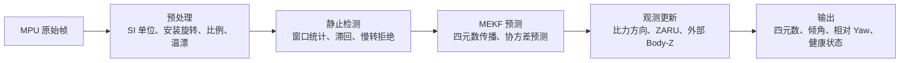

# Raspberry Pi 4B Python IMU

这是面向树莓派 4B 小车的 Python IMU 姿态解算包。核心算法采用 Hamilton 四元数和
6 状态 MEKF，完成传感器预处理、启动静止调零、静止检测、零角速度更新（ZARU）、
Roll/Pitch 重力方向校正，以及可选的外部 Body-Z 角速度辅助。

默认针对实机 MPU6500 兼容器件设计，当前适配 I2C1 地址 `0x68`、`WHO_AM_I=0x70` 的
安装方向。包内提供小车运行示例、60 秒健康验收脚本，以及树莓派本机 PyQt5 数字监控
界面。

## 算法概览

完整数据流是：原始传感器帧 -> 预处理 -> 静止检测 -> MEKF 预测/观测更新 -> 业务输出。



### 传感器预处理

预处理只做确定性校正，不重复扣除运行时偏置。加速度计按量程换算到 `m/s²`，再做
温度补偿、比例/非正交校正和安装旋转；陀螺仪按量程换算到 `rad/s`，再做温度模型、
比例/非正交校正和安装旋转。

运行时只保留一个陀螺偏置 `b_g`。启动静止均值直接初始化它，ZARU 和外部轮速后续继续
更新同一个 `b_g`。如果预处理层额外永久扣除一份启动残余偏置，会造成重复减偏。

### 启动静止调零

上电后系统处于未就绪状态，必须保持静止直到连续静止窗口通过。启动阶段使用非重叠
窗口统计预处理角速度与比力模长；合格后，系统会用平均比力方向初始化 Roll/Pitch，
用平均预处理角速度初始化 `b_g`，并建立初始协方差。初始化完成前，角度接口返回
`None`，而不是输出未经验证的零角度。

### 静止检测与 ZARU

运行期静止检测统计窗口内的角速度均值、标准差、峰峰值和比力稳定性，并使用进入/退出
滞回避免单帧毛刺误触发。只有静止窗口通过后，才会把零角速度观测用于 ZARU。

ZARU 的创新观测是静止时校正角速度均值接近零，因此它主要帮助估计 `b_g`；姿态传播
始终正常进行，不会因为“近似静止”就人为停止 Yaw 积分。

### 6 状态 MEKF

名义状态保留 Hamilton 四元数 `q_WB` 和唯一陀螺偏置 `b_g`；误差状态是 3 维姿态误差
加 3 维偏置误差。每个有效采样周期先计算校正角速度，再用 SO(3) 指数映射传播四元数，
并做 6×6 协方差预测。

观测更新遵循同一个 MEKF 框架：比力方向更新只投影到重力切平面，因此只能约束
Roll/Pitch；ZARU 更新只更新偏置相关状态；外部 Body-Z 角速度更新也只影响预期的
偏置项，不会假装提供绝对航向。

测量更新使用 Joseph 形式保持协方差半正定，并在误差注入后通过右 Jacobian 做状态
Reset。候选四元数、偏置和协方差先完成检查，再一次性提交，避免半更新状态。

### 输出语义

| 输出 | 含义 |
| --- | --- |
| `quaternion_wb` | 完整且无欧拉角奇异的姿态表示 |
| `roll_deg` / `pitch_deg` | 由预测重力方向得到的重力倾斜角 |
| `relative_yaw_deg` | 从启动或最近清零方向起算的相对 Yaw |
| `corrected_gyro_body` | 减去当前偏置后的机体系角速度 |
| `linear_acceleration_world_mps2` | 世界系去重力后的线加速度，不是线速度 |

`roll_deg` 和 `pitch_deg` 与 Yaw 解耦，但范围约为 ±90°，不能描述任意大姿态。需要
完整姿态时，应直接使用四元数。相对 Yaw 清零只改变输出参考，不修改内部四元数、偏置
或协方差。

## 能力边界

| 项目 | 说明 |
| --- | --- |
| Roll/Pitch | 可由静止或准静态比力方向长期约束，小角度静止下稳定 |
| 相对 Yaw | 启动调零和 ZARU 后可提供短期相对航向 |
| 旋转 Yaw | 长时间无绝对航向观测时仍会漂移 |
| 绝对航向 | 无磁、无视觉或其他绝对航向观测时，Yaw 长期不可观 |
| 外部轮速 | 可帮助估计 Z 轴陀螺偏置，但不能单独提供绝对航向 |
| 推荐输出 | 完整姿态以四元数为准，重力倾斜角仅用于业务显示 |

六轴 IMU 的物理限制很明确：

- 加速度计在静止时约束的是比力相对重力的方向，因此 Roll/Pitch 更可靠；
- 绕世界重力方向旋转不改变加速度计读数，所以 Yaw 只能短期保持；
- 若车辆需要长期航向，应额外融合差速轮、视觉、GNSS 航向或磁力计；
- 不要把陀螺积分系数当成弥补无绝对航向的主要手段。

当前台架结果只代表参考实现和测试条件，不是精度保证。不同传感器个体、安装方向和车
辆工况都会影响最终表现。

## 环境

- Python 3.7 或更高版本
- NumPy 1.17 或更高版本
- Raspberry Pi OS 自带的 `python3-smbus`，也兼容可选的 `smbus2`

在本目录安装：

```bash
sudo apt-get install python3-numpy python3-smbus
python3 -m pip install --user -e . --no-deps
```

目标树莓派是 ARMv7/Python 3.7，优先使用系统已经提供的 NumPy 1.17 和
`python3-smbus`。`--no-deps` 用于避免 pip 在板上尝试源码编译新版 NumPy。

树莓派必须存在 `/dev/i2c-1`，用户需要属于 `i2c` 组。

## 实机测试

上电后让小车保持静止至少一秒，然后运行：

```bash
python3 examples/car_demo.py   --calibration examples/calibration.rpi4b-car-mpu6500.json   --duration 10
```

默认配置为 200 Hz、94 Hz DLPF、陀螺 `+-2000 dps`、加速度 `+-16 g`。
程序约用 600 ms 的连续静止窗口完成倾角和陀螺零偏初始化；完成前
`get_angles()` 返回 `None`。

`calibration.rpi4b-car-mpu6500.json` 使用当前侧装 MPU6500 的候选右手系映射：
`Body X = Sensor X`、`Body Y = Sensor Z`、`Body Z = -Sensor Y`。实测已经确认
`Sensor -Y` 朝上；该档案进一步假设 `Sensor X` 朝车头。若板上 X 箭头不朝车头，
必须先修正 XY 映射，不能只凭静止 Roll/Pitch 判断车头方向。

部署到树莓派后执行 60 秒稳定性验收：

```bash
cd /home/pi/imu-estimation
python3 -m pip install --user -e . --no-deps
python3 examples/health_check.py --duration 60
```

脚本每 5 秒输出完整健康快照，结束时输出 `FINAL_METRICS` JSON。验收要求包括：
无故障、无 I2C 错误、数据未过期、最终状态为 `OK`、有效频率和成功帧数不低于
目标的 90%，并且错过的调度截止时间不超过目标帧数的 2%。

## 小车程序集成

```python
from imu_estimation import ImuEstimator
from imu_estimation import load_calibration_json

calibration = load_calibration_json(
    "examples/calibration.rpi4b-car-mpu6500.json")
imu = ImuEstimator(calibration_config=calibration)
imu.start()
try:
    angles = imu.get_angles()
    health = imu.get_health()
finally:
    imu.stop()
```

`roll_deg` 和 `pitch_deg` 是与 Yaw 解耦的重力倾斜角；`relative_yaw_deg` 是可清零的
短期相对航向。六轴 IMU 没有绝对航向观测，Yaw 长期一定会漂移。

差速轮角速度可通过 `set_yaw_rate_provider()` 注入。回调接收当前 IMU 微秒时间戳，
返回新的 `YawRateObservation`；每条轮速必须使用新的 `source_sequence`，不得重复融合。

标定档案格式见 `examples/calibration.identity.json`。单位档案只能用于先验证数据链路，
不能替代针对当前传感器的六面、比例和温漂标定。

## 本机 PyQt5 监控界面

树莓派本机桌面已经提供 `python3-pyqt5` 时，运行：

```bash
cd /home/pi/imu-estimation
python3 examples/imu_dashboard.py
```

界面以 20 Hz 刷新，但不会改变后台 200 Hz I2C 采样；可显示原始计数、姿态、四元数、
校正角速度、陀螺零偏、机体系比力、世界系去重力线加速度及总线健康状态。`线速度` 明确
显示为未接入：六轴 IMU 的纯积分会快速漂移，不能当作小车控制速度使用。

若系统缺少 PyQt5，使用系统包安装：

```bash
sudo apt-get install python3-pyqt5
```

此界面需要树莓派本机 LXDE/HDMI 图形会话；SSH 无显示时继续使用
`examples/car_demo.py` 或 `examples/health_check.py`。

## 参数与更换传感器

| 参数类别 | 所属层级 |
| --- | --- |
| I2C 地址、量程、DLPF、采样率 | 传感器配置 |
| 安装矩阵、比例、加速度偏置、温漂 | 标定与设备档案 |
| 窗口长度、静止门限、滞回 | 静止检测 |
| 过程噪声、观测方差、注入门限 | MEKF |

设备专属参数不能跨 MPU6050/MPU6500 个体直接复制。更换传感器后，应先使用单位标定
验证链路，再重新采集六面、比例和温漂数据生成新档案。

## 进一步阅读

- [算法原理与接口说明](docs/IMU_算法原理与接口说明.md)：完整数学模型、坐标约定和输出定义；
- [解算库实现教程](docs/IMU_解算库实现教程.md)：模块拆分、实现顺序、验证方法和验收标准；
- [标定与复现教程](docs/IMU_标定与复现教程.md)：六面标定、温漂、比例标定和复现方法。
