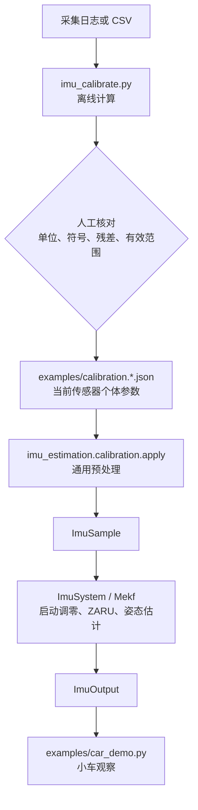

# MPU6050 MEKF 标定与复现教程

## 1. 这篇教程解决什么问题

这篇教程面向第一次拿到本模块的人：不需要理解目标平台驱动内部实现，也能完成
一块新 MPU6050/MPU6500 的数据采集、离线拟合、参数接入和结果验证。

最重要的边界是：

- `imu_estimation.calibration.apply()` 定义通用校正算法；
- `examples/calibration.*.json` 保存当前传感器个体的参数；
- `examples/car_demo.py` 只演示初始化、调度和输出，不保存任何标定数值；
- `tools/imu_calibrate.py` 在电脑上计算候选参数；
- MEKF 的运行时偏置 `b_g` 仍由启动调零和 ZARU 估计，不能与离线温漂重复相减。

换一块传感器时，算法核心和 `examples/` 都不应修改，只重新生成并替换设备档案。

## 2. 文件与依赖关系



应用初始化只需：

```python
from imu_estimation import ImuEstimator, load_calibration_json

calibration = load_calibration_json(
    "examples/calibration.rpi4b-car-mpu6500.json")
imu = ImuEstimator(calibration_config=calibration)
imu.start()
try:
    angles = imu.get_angles()
    health = imu.get_health()
finally:
    imu.stop()
```

标定档案可随小车仓库一起管理，也可单独放在小车配置目录。档案 API 不依赖具体硬件
平台，可以原样用于其他 Linux 小车或主机程序。

## 3. 坐标、单位和校正顺序

本工程把 MPU 芯片轴记为传感器系 $S$，把车辆轴记为车体系 $B$：X 向前、Y
向左、Z 向上。所有标定输入必须先确认仍处于 $S$ 系，不能先在 `examples/` 里交换轴。

公共物理单位固定为：加速度 `m/s²`、角速度 `rad/s`、温度 `°C`、时间 `s/us`。
串口或 CSV 为了可读性可能使用 `mm/s²`、`mrad/s` 或 `mdps`，写档案前必须按表头单位
换算，不能只看数字。

加速度校正：

$$
\mathbf f_{\mathrm{pre},B}
=R_{BS}C_a
\left(\mathbf f_{\mathrm{raw,SI},S}-\mathbf b_{a,S}\right).
$$

陀螺校正与 MEKF 使用：

$$
\boldsymbol\omega_{\mathrm{pre},B}
=R_{BS}C_g
\left(
\boldsymbol\omega_{\mathrm{raw,SI},S}-\mathbf b_{T,S}(T)
\right),
$$

$$
\boldsymbol\omega_B
=\boldsymbol\omega_{\mathrm{pre},B}-\hat{\mathbf b}_g.
$$

`b_T(T)` 是离线温度模型，`b_g` 是 MEKF 唯一的运行时残余偏置。启动静止均值
直接初始化 `b_g`；ZARU 后续也只更新 `b_g`，不存在第二个运行偏置。

矩阵采用行主序含义：

$$
y_i=\sum_{j=1}^{3}M_{ij}x_j.
$$

因此校正矩阵 `[0][2]` 表示“输入 Z 对校正后 X 的贡献”。符号写反会
放大耦合，必须用正反旋转复核。

### 3.1 静止检测与 ZARU 的边界

ZARU 只能在真正的零角速度窗口内更新 `b_g`。如果手在起转时的慢速
角速度被当成零偏，后续即使正常积分，Yaw 也会按“错误偏置 × 运动
时间”线性积累。2026-09-10 的实测基线为：

| 静止统计量 | 当前实测基线 |
|---|---:|
| 校正角速度模长 | 通常小于 0.9 mrad/s |
| 单轴标准差 | 约 1 mrad/s |
| 单轴峰峰值 | 约 6～9 mrad/s |

因此当前默认使用 `1.5 mrad/s` 运行期均值门限、`3 mrad/s` 标准差
门限和 `12 mrad/s` 峰峰值门限。这些门限只决定是否接受静止观测；
即使窗口被判为运动，MEKF 仍然正常传播四元数，所以这不是 Yaw 死区。
换传感器、DLPF、量程或机械安装后，必须用新的静止和慢转日志重新验证。

## 4. 环境准备

只需要 Python 3，标定工具不需要额外安装重型依赖：

```powershell
python tools\imu_calibrate.py --help
```

建议每次实验建立单独目录，保留原始日志、整理后的 CSV、命令和输出文本。不要反复
覆盖同一个文件。串口助手缓存有限时降低记录频率，而不是缩短温度覆盖时间；温漂
数据通常每 5～30 秒记录一个静止窗口均值就足够。

## 5. 六面加速度计标定

### 5.1 采集

依次让芯片 `+X/-X/+Y/-Y/+Z/-Z` 朝上。每次放稳后等待静止检测确认，记录多个
窗口均值。面包板、线材和手压会让姿态不正，最好使用直角治具；同一面多取几组，
脚本会先求均值。

CSV 表头和示例：

```csv
face,fx_mps2,fy_mps2,fz_mps2
+x,10.12,0.02,0.18
+x,10.13,0.01,0.17
-x,-9.34,-0.03,-0.39
+y,0.38,9.82,0.73
-y,0.41,-9.70,-1.47
+z,0.44,0.17,9.80
-z,-0.14,0.68,-9.78
```

`face` 描述传感器轴朝上方向，不是照片方向。每个方向至少一行，推荐 5 个以上
稳定窗口。

### 5.2 计算

```powershell
python tools\imu_calibrate.py accel-six-face data\accel_six_face.csv
```

每轴使用：

对第 $i$ 个轴，设正面和反面静止均值分别为 $a_i^+$、$a_i^-$，则

$$
b_{a,i}=\frac{a_i^++a_i^-}{2},
\qquad
s_{a,i}=\frac{2g}{a_i^+-a_i^-}.
$$

脚本会输出 `accel_bias_sensor_mps2[]`、三个对角比例和可直接复制到 JSON 标定档案
的内容。首版只拟合对角比例；六个方向不足以稳健识别完整椭球非正交矩阵。

### 5.3 验证

使用独立于拟合数据的新一轮六面记录。重点检查：

- 每一面的校正后模长是否接近当地重力；
- 非主轴分量是否能由摆放误差解释；
- 正负面误差是否近似对称；
- Roll/Pitch 回到同一基准时是否可重复。

脚本的残差接近零只说明它重构了拟合数据，不等于独立验证通过。

## 6. 陀螺温漂标定

### 6.1 采集原则

传感器全程固定并保持静止，让芯片经历实际使用会遇到的自然升温和环境温度变化。
记录静止窗口内的温度以及尚未减运行时 `b_g` 的三轴角速度均值。若日志取的是
`gyro_corrected`，ZARU 会把偏置吸收到 `b_g`，该数据不能再用于拟合离线温漂。

温度变化太小时，拟合出的斜率会被噪声主导。普通室内使用无需追求高温，但采集温区
必须覆盖实际工作区间；空调造成的降温数据有价值，也可用于观察升温/降温热滞后。

CSV 格式：

```csv
temperature_c,gx_rad_s,gy_rad_s,gz_rad_s,stationary
27.80,-0.2831,0.0789,-0.0255,1
28.35,-0.2844,0.0792,-0.0257,1
29.10,-0.2850,0.0798,-0.0259,1
```

`stationary` 可省略；存在时，`0/false/no` 行会被排除。三轴必须是 `rad/s`。

### 6.2 拟合与选择阶数

先拟合一次模型：

```powershell
python tools\imu_calibrate.py temperature data\temperature.csv --degree 1 --reference-temperature 29
```

仅当残差随温度呈稳定弯曲、且独立数据也改善时再试二次：

```powershell
python tools\imu_calibrate.py temperature data\temperature.csv --degree 2 --reference-temperature 29
```

模型为：

$$
b_T(T)=c_0+c_1\left(T-T_{\mathrm{ref}}\right)
+c_2\left(T-T_{\mathrm{ref}}\right)^2.
$$

优先选择较简单且独立验证更好的模型。档案中的 `temperature_min_c/max_c` 必须写成
真实采集范围；核心会在范围外钳位并设置告警，避免二次多项式失控外推。

## 7. 陀螺比例与交叉轴

### 7.1 主轴比例

固定旋转轴，分别做多次正向和反向已知角度（推荐 360°），积分校正角速度。比例为
“真实角度 / 测量角度”。正反结果差异较大时先检查手工基准、零偏、动作起止和温度，
不要立即增加补偿项。

Z 轴推荐的可复现流程是：起点静置至少 3 s，绕 Body Z 轴正向整数
5 圈后静置至少 3 s，再反向 5 圈回到同一机械基准，最后静置至少
3 s。旋转时 Z 轴尽量保持竖直，不要快速冲击起停。最终姿态日志可直接计算：

```powershell
python tools\imu_calibrate.py gyro-z-scale log2.txt --turns 5 --current-entry 1.0
```

工具会只分析时间戳重启后的最新会话，展开 `RelativeYawAngle`，再取起点、
远端和终点的安静平台中值。它分别给出正向与返程系数，并用两个
行程的平均给出 `combined correction`。新的对角项为：

$$
C_{g,zz}^{\mathrm{new}}
=C_{g,zz}^{\mathrm{current}}\,k_{\mathrm{combined}}.
$$

工具还会报告最大 Roll/Pitch 倾斜和日志中的 I²C 累计错误数。正反行程
差异明显、倾斜大、错误计数高或串口缓冲区截断了任一平台时，结果只能
作为候选值。第一份日志拟合后，必须写入设备专用档案，并用另一份独立
正反多圈日志验证；不得修改 `GENERIC_IDENTITY` 通用基线。

### 7.2 X-Z/Y-Z 非正交拟合

2026-09-09 修订：旧单比力导数法遗漏绕 Z 转动与已有倾斜的耦合项，不能据此
确认 `C_g[0][2]=0.0201`、`C_g[1][2]=0.0630` 是器件非正交参数。两项数值目前
仅保留作历史对照。工具现在从刚体坐标系中的完整重力方向运动关系开始：

$$
\dot{\mathbf f}=-\boldsymbol\omega\times\mathbf f
$$

可整理得到横轴物理角速度：

$$
\omega_x^{\mathrm{physical}}
=\frac{\dot f_y+\omega_zf_x}{f_z},
\qquad
\omega_y^{\mathrm{physical}}
=\frac{\omega_zf_y-\dot f_x}{f_z}.
$$

拟合残差定义为

$$
r_{\perp}
=\omega_{\perp}^{\mathrm{measured}}
-\omega_{\perp}^{\mathrm{physical}}.
$$

必须确认比力由重力主导、Z 轴角速度已校准且所有量同帧同坐标系。匀速绕世界竖直轴
转动时，倾斜板子的比力方向可以不变，但机体系横轴角速度并非零；正反方向比例一致
不能单独证明器件误差。手推平动也会破坏上述关系，模长接近 g 不能排除这种情况。

串口每一条记录必须包含 `CorrectedAngularRateX` 或 `CorrectedAngularRateY`、
`CorrectedAngularRateZ`（均为 mrad/s）及 `SpecificForceX/Y/Z`（均为 mm/s²）。
旧单比力日志会报错。脚本检测 INFO 时间戳回退，只分析最后一次启动后的会话；
如果最新会话缺字段，不回退使用旧会话。也支持同帧 CSV，角速度为减偏后的 rad/s：

```csv
time_s,gx_rad_s,gy_rad_s,gz_rad_s,fx_mps2,fy_mps2,fz_mps2
0.010,0.020,-0.065,1.000,0.200,-0.638,9.780
```

示例仅说明格式，不构成足够的标定样本。当前演示固件已输出含 40 个字段的 `IMU1`
定点 CSV 记录，可直接交给 cross-axis，或先解码为带表头及 SI 单位的 CSV：

```powershell
python tools\imu_calibrate.py decode-log LOG.TXT data\imu_decoded.csv
```

输出目录需事先存在。解码保留最新会话，启动未就绪记录的角度为空；cross-axis
自动跳过未就绪记录。字段的坐标和物理意义见
[IMU 算法原理与接口说明](IMU_算法原理与接口说明.md)。

```powershell
python tools\imu_calibrate.py cross-axis data\cross_axis.csv --axis x --window-ms 120 `
  --z-threshold-mrad-s 100 --z-scale 1.00595 --current-entry 0.02010

python tools\imu_calibrate.py cross-axis data\cross_axis.csv --axis y --window-ms 120 `
  --z-threshold-mrad-s 100 --z-scale 1.00595 --current-entry 0.06300
```

输出为有条件的诊断候选值，不会写入设备档案。`conditional matrix delta` 换算仅在
`sensor_to_body=I`、Z 输出仅含 `C_g[2][2]` 比例项时成立；传入 `--current-entry`
会显示候选绝对值。完整矩阵或非单位安装旋转必须重新推导，不能沿用该标量换算。
窗口使用两端比力差估计导数，不使用缺少前后邻点的端部样本。窗口内比力模长偏离 g
超过 0.8 m/s²、|fz|<0.5g 或采样间断超过半窗口时跳过；非有限数据及重复/逆序时间戳
直接报错。上述门限只排除明显异常，不代表平动、时间延迟和机械基准已经验证。
必须用独立正反、多速度及不同初始倾斜的记录复核；不根据一轮 RMS 小就修改档案。

## 8. 更新设备档案

打开 `examples/calibration.rpi4b-car-mpu6500.json`，只替换已经验证的字段，同时更新
文件顶部的数据日期、样本量、温区和方法。未测项目保持单位矩阵或零值，不要猜数。

保存档案后，使用未参与拟合的独立数据重复下一节的复验流程。只有验证集上的方向、
比例和闭环误差也得到改善，候选参数才可以作为该传感器的正式档案。

## 9. 目标设备复验顺序

显示时可只观察两三个量，但用于定标/回放的采集必须保留同帧所需字段，不能为减少
显示量而省略三轴比力。通过降频或二进制帧控制带宽，并核对样本序号及丢帧：

1. 六面静置：三轴比力均值与模长；
2. 静止检测：比力模长标准差与校正角速度模长；
3. Z 轴正反旋转：校正 Z 角速度与累计 Yaw；
4. X/Y 独立往返：Roll/Pitch 以及 Yaw 的闭环误差；
5. 静置 5～10 分钟后重复 90°、180°、360°；
6. 冷启动、热启动各重复一次；
7. 最后再接入差速轮 `BODY_Z` 角速度回调。

记录开始姿态、动作方向、真实角度、结束姿态和是否重新对准基准。Euler 角接近
Pitch ±90° 时本身存在奇异性，应结合四元数或重力方向判断，不能根据一个 Euler
分量跳变直接修改传感器补偿。

## 10. 常见错误

- **把参数写进 Demo**：会让示例、硬件调度和设备个体数据耦合；本工程禁止这样做。
- **复制别人的参数**：同型号不同个体、供电、装配应力和安装方式都可能不同。
- **单位混用**：`mdps`、`mrad/s`、`rad/s` 相差很大，必须以 CSV 表头为准。
- **温漂与 `b_g` 重复扣除**：温标处理 `omega_pre` 前的确定性偏置，MEKF 只再减一次
  自己的 `b_g`。
- **运动期间拟合温漂**：真实角速度会被当成偏置；只保留确认静止的窗口。
- **只看拟合残差**：必须使用另一轮数据验证，否则容易过拟合。
- **串口文件被截断或追加**：降低长期日志频率，分段保存，并核对时间戳是否重启。
- **超温区外推**：当前档案只适用于声明温区，超出后应重新采集而不是放宽范围。
- **用补偿掩盖 Euler 奇异**：先检查四元数约定、输出定义和真实动作，再判断是否是
  传感器耦合。