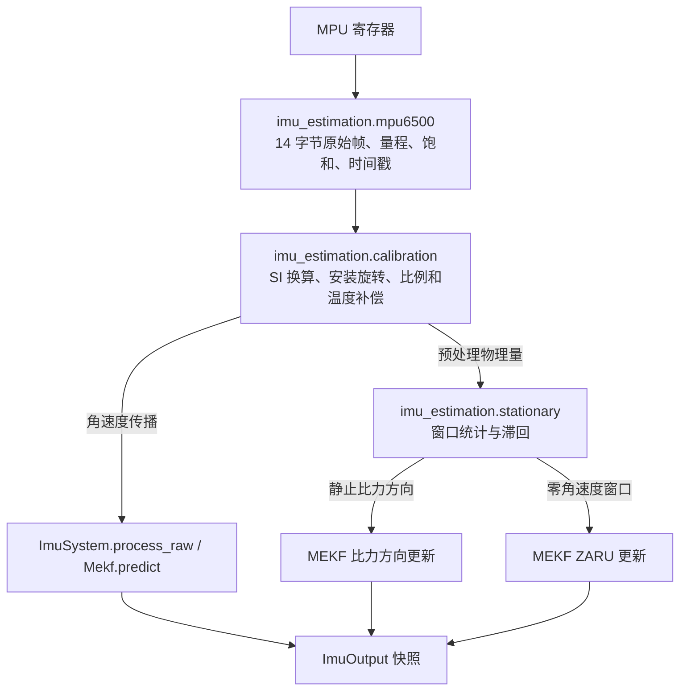
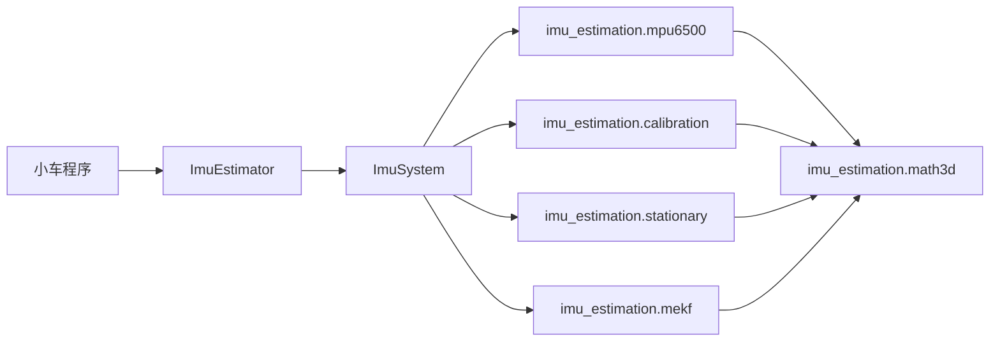

# IMU 算法原理与接口说明

## 1. 目标与物理限制

本包面向树莓派 4B 小车上的 MPU6050/MPU6500，使用 Hamilton 四元数和 6 状态 MEKF
估计姿态。陀螺负责短时动态传播；静止或准静态时，加速度计提供机体相对重力方向，
约束 Roll 和 Pitch；静止检测确认设备不动后，ZARU 更新陀螺零偏。

六轴传感器没有绝对航向观测。绕世界重力方向旋转不会改变加速度计输出，因此 Yaw
不可观。本包能减慢静态漂移并提供短期相对 Yaw，但不能承诺长时间绝对航向准确。
需要长期航向时，必须融合差速轮、视觉、GNSS 航向或磁力计等独立信息。

## 2. 坐标、四元数和符号约定

整个 Python 包固定使用以下约定，修改其中任何一项都必须重新推导相关乘法顺序和
Jacobian：

- 机体系 B：X 向前、Y 向左、Z 向上；
- 世界系 W：Z 向上；
- `q_WB`：Hamilton 四元数，顺序 `[w,x,y,z]`，把 B 系向量旋转到 W 系；
- 误差采用右乘：$q_{\mathrm{true}}=q_{\mathrm{nominal}}\otimes\operatorname{Exp}(\delta\boldsymbol\theta)$；
- 正旋转遵循右手定则，从上向下看绕 +Z 逆时针为正 Yaw；
- 角度和角速度在接口内统一使用 rad 与 rad/s，日志显示时才转换为 degree。

静止时加速度计测到的是比力，不是世界重力向量本身：

$$
\mathbf f_B
= R_{BW}\left(\mathbf a_W-\mathbf g_W\right),
\qquad
\mathbf g_W=
\begin{bmatrix}
0 & 0 & -g
\end{bmatrix}^{\mathsf T}.
$$

当设备静止且 Z 轴向上时，$\mathbf a_W=\mathbf 0$，所以

$$
\mathbf f_B=-R_{BW}\mathbf g_W
\approx
\begin{bmatrix}
0 & 0 & g
\end{bmatrix}^{\mathsf T}.
$$

## 3. 分层与数据流

依赖方向固定为：

本包把 I2C、线程、日志和操作系统调用限制在 `imu_estimation.mpu6500` 与
`ImuEstimator` 中；算法核心仍只接受 SI 物理量。平台差异只应出现在驱动和运行壳
层，应用调度和输出只应出现在小车业务代码或 `examples/`。

## 4. 传感器预处理

### 4.1 加速度计

原始计数先按量程换为传感器坐标系 S 下的 SI 单位，再做确定性标定与安装旋转：

$$
\mathbf f_{\mathrm{pre},B}
=R_{BS}C_a
\left(\mathbf f_{\mathrm{raw,SI},S}-\mathbf b_a\right).
$$

其中 `b_a` 是加速度计偏置，`C_a` 是比例/非正交校正矩阵，`R_BS` 把传感器安装坐标
转到机体系。首选通过六面静置数据求对角比例和偏置，再由
`imu_estimation.config.load_calibration_json()` 载入设备档案。

### 4.2 陀螺仪

陀螺预处理定义为：

$$
\boldsymbol\omega_{\mathrm{pre},B}
=R_{BS}C_g
\left(
\boldsymbol\omega_{\mathrm{raw,SI},S}-\mathbf b_T(T)
\right).
$$

`b_T(T)` 是离线识别的温度偏置模型，`C_g` 是比例/非正交校正矩阵。
`omega_pre,B` 尚未减运行时偏置。

系统只有一个运行时陀螺偏置状态 `b_g`：

$$
\boldsymbol\omega_B
=\boldsymbol\omega_{\mathrm{pre},B}-\hat{\mathbf b}_g.
$$

启动静止均值直接作为 `b_g(0)`，ZARU 后续更新同一个 `b_g`。禁止在预处理层再永久
扣除一份“启动残余偏置”，否则会发生重复减偏。

## 5. 启动与静止检测

上电后 `ImuEstimator` 处于未就绪状态，按非重叠窗口统计：

- `omega_pre` 三轴均值、标准差和峰峰值；
- 校正角速度 `omega_pre-b_g` 的窗口均值（仅运行期）；
- 比力模长均值和标准差。

启动时不能依赖尚未可信的 `b_g`，主要使用 `omega_pre` 的变化量与比力稳定性，并给
陀螺均值保留覆盖器件零偏的宽门限。连续若干合格窗口后：

1. 用平均比力方向初始化 Roll/Pitch，初始 Yaw 定义为零；
2. 用平均 `omega_pre` 初始化唯一的 `b_g`；
3. 初始化 6x6 协方差并置位就绪。

初始化完成前，`get_angles()` 返回 `None`，而不是输出未经验证的零角度。

运行期追加严格的校正角速度门限。静止判定采用进入/退出滞回，避免单帧毛刺改变
状态。静止只允许触发观测更新，不允许停止四元数传播或把小角速度直接清零。

## 6. 6 状态 MEKF 状态与预测

名义状态为：

$$
\mathbf x_{\mathrm{nominal}}
=\left\{\hat q_{WB},\hat{\mathbf b}_g\right\}.
$$

误差状态为：

$$
\delta\mathbf x
=
\begin{bmatrix}
\delta\boldsymbol\theta\\
\delta\mathbf b_g
\end{bmatrix}
\in\mathbb R^6.
$$

每个有效采样周期先计算
$\boldsymbol\omega_B=\boldsymbol\omega_{\mathrm{pre},B}-\hat{\mathbf b}_g$，
然后传播：

$$
\hat q_{WB,k}
=\operatorname{normalize}\!\left(
\hat q_{WB,k-1}\otimes
\operatorname{Exp}\!\left(\boldsymbol\omega_{B,k}\Delta t\right)
\right).
$$

在当前右乘误差约定下，连续误差模型为：

$$
\begin{aligned}
\delta\dot{\boldsymbol\theta}
&=-[\boldsymbol\omega_B]_\times\delta\boldsymbol\theta
-\delta\mathbf b_g-\mathbf n_g,\\
\delta\dot{\mathbf b}_g&=\mathbf n_b.
\end{aligned}
$$

令连续白噪声向量
$\mathbf w=[\mathbf n_g^{\mathsf T},\mathbf n_b^{\mathsf T}]^{\mathsf T}$，则

$$
\delta\dot{\mathbf x}=F\delta\mathbf x+G\mathbf w,
$$

$$
F=
\begin{bmatrix}
-[\boldsymbol\omega_B]_\times & -I_3\\
0_3 & 0_3
\end{bmatrix},
\qquad
G=
\begin{bmatrix}
-I_3 & 0_3\\
0_3 & I_3
\end{bmatrix}.
$$

`n_g` 是陀螺白噪声，`n_b` 是偏置随机游走。配置字段
`gyro_noise_density_rad_s_sqrt_hz` 和
`gyro_bias_random_walk_rad_s2_sqrt_hz` 是连续时间噪声密度，不是单采样点标准差。

若陀螺白噪声密度和偏置随机游走密度分别为 $\sigma_g$、$\sigma_b$，连续噪声协方差为

$$
Q_c=
\operatorname{diag}\!\left(
\sigma_g^2 I_3,\;\sigma_b^2 I_3
\right).
$$

状态转移和离散噪声严格定义为

$$
\Phi_k=\exp(F_k\Delta t),
$$

$$
Q_{d,k}=\int_0^{\Delta t}
\Phi(\tau)GQ_cG^{\mathsf T}\Phi(\tau)^{\mathsf T}
\,\mathrm d\tau.
$$

实现使用 SO(3) 指数映射得到姿态转移块，并保留姿态与偏置耦合。协方差预测为

$$
P_k=\Phi_kP_{k-1}\Phi_k^{\mathsf T}+Q_{d,k}.
$$

在各向同性、短采样周期近似下，离散噪声的主要分块为

$$
\begin{aligned}
Q_{\theta\theta}
&=\sigma_g^2\Delta t\,I_3
+\frac{\sigma_b^2\Delta t^3}{3}I_3,\\
Q_{\theta b}=Q_{b\theta}^{\mathsf T}
&=-\frac{\sigma_b^2\Delta t^2}{2}I_3,\\
Q_{bb}&=\sigma_b^2\Delta t\,I_3.
\end{aligned}
$$

时间戳不递增或 `dt` 超过配置边界时拒绝该帧，不能用固定周期掩盖漏帧。

## 7. 比力方向更新

动态运动时加速度计包含平动加速度，不能无条件当作重力。只有静止检测通过且模长
接近 `g` 时才使用其方向：

$$
\hat{\mathbf f}_{\mathrm{meas}}
=\frac{\mathbf f_{\mathrm{pre},B}}
{\left\|\mathbf f_{\mathrm{pre},B}\right\|},
\qquad
\hat{\mathbf f}_{\mathrm{pred}}
=R_{BW}(\hat q_{WB})\mathbf e_3,
$$

其中 $\mathbf e_3=[0,0,1]^{\mathsf T}$。方向创新取为

$$
\mathbf r_f
=\hat{\mathbf f}_{\mathrm{meas}}
\times\hat{\mathbf f}_{\mathrm{pred}}.
$$

叉积残差有三个分量但秩为 2，只能观测与重力方向正交的两个姿态自由度。实现将 Kalman
增益投影到重力切平面，并在更新前后保持 fused yaw 不变，因此加速度计不会偷偷校正
不可观的 Yaw，也不会通过协方差更新虚假地缩小航向不确定度。

## 8. ZARU 零角速度更新

确认静止后，真实角速度观测为零：

$$
\mathbf z_{\mathrm{ZARU}}=\mathbf 0,
\qquad
\mathbf h(\mathbf x)
=\bar{\boldsymbol\omega}_{\mathrm{pre},B}-\hat{\mathbf b}_g.
$$

因此创新和 Jacobian 为

$$
\boldsymbol\nu
=-\left(
\bar{\boldsymbol\omega}_{\mathrm{pre},B}-\hat{\mathbf b}_g
\right),
\qquad
H_{\mathrm{ZARU}}
=\begin{bmatrix}0_3&-I_3\end{bmatrix}.
$$

实现把姿态增益投影为零，只更新 `b_g` 及相关协方差。更新后的传播仍正常使用
`omega_pre-b_g`；没有 `if (abs(gyro)<threshold) yaw不积分` 之类的人工死区。

使用非重叠窗口均值而不是在高速采样下重复融合高度相关的样本，避免协方差收缩
过快。门限过松会把缓慢真实旋转吸收到偏置里，因此静止检测参数必须同时验证静止
噪声和慢速转动。

## 9. 误差注入与 Reset

对任一线性化观测，先计算

$$
S=HPH^{\mathsf T}+R,
\qquad
K=PH^{\mathsf T}S^{-1},
\qquad
\delta\mathbf x=K\boldsymbol\nu.
$$

为减小有限精度下协方差失去半正定性的风险，使用 Joseph 形式：

$$
P_J=(I-KH)P(I-KH)^{\mathsf T}+KRK^{\mathsf T}.
$$

将误差状态中的 $\delta\boldsymbol\theta$ 和 $\delta\mathbf b_g$ 注入名义状态：

$$
\hat q_{WB}^{+}
=\operatorname{normalize}\!\left(
\hat q_{WB}^{-}\otimes\operatorname{Exp}(\delta\boldsymbol\theta)
\right),
\qquad
\hat{\mathbf b}_g^{+}
=\hat{\mathbf b}_g^{-}+\delta\mathbf b_g.
$$

随后误差状态重新定义在新的名义点，协方差必须同步变换：

$$
P^{+}=G_{\mathrm{reset}}P_JG_{\mathrm{reset}}^{\mathsf T},
\qquad
P^{+}\leftarrow\frac{1}{2}
\left(P^{+}+P^{+\mathsf T}\right).
$$

代码使用 Joseph 形式更新协方差，并用 SO(3) 右 Jacobian 构造 Reset。状态和协方差先在
临时变量中完成数值检查，再一次性提交，避免出现“四元数更新成功但协方差损坏”的
半更新状态。

## 10. 输出语义

### 10.1 推荐业务输出

- `quaternion_wb`：完整且无欧拉角奇异的姿态表示；
- `gravity_tilt_roll_rad`、`gravity_tilt_pitch_rad`：由预测重力方向得到的倾角；
- `mekf_fused_yaw_rad`：倾斜解耦的 fused yaw；
- `gyro_corrected_body_rad_s`：减去当前偏置后的机体系角速度。

对应数学定义为

$$
\begin{aligned}
\phi_{\mathrm{tilt}}
&=\arcsin\!\left(\hat f_{\mathrm{pred},y}\right),\\
\theta_{\mathrm{tilt}}
&=\arcsin\!\left(-\hat f_{\mathrm{pred},x}\right),\\
\psi_{\mathrm{fused}}
&=\operatorname{wrap}\!\left(
2\operatorname{atan2}(q_z,q_w)
\right),\\
\boldsymbol\omega_{\mathrm{corrected},B}
&=\boldsymbol\omega_{\mathrm{pre},B}-\hat{\mathbf b}_g.
\end{aligned}
$$

倾斜角只描述重力相对机体的方向，不含 Yaw，因此不会因改变 Yaw 而变化。它们的范围
是正负 90 度；设备越过 90 度后会折返，完整大姿态必须使用四元数。

### 10.2 兼容与诊断输出

`roll_rad/pitch_rad/yaw_rad` 是 ZYX 欧拉角。Pitch 接近正负 90 度时 Roll 与 Yaw 会发生
数学耦合和跳变，这是表示法奇异，不是四元数状态跳变。

`gyro_only_*`、原始倾角、更新计数和协方差对角线用于对比测试与故障定位，不建议直接
作为控制输入。

## 11. 对外接口边界

普通使用者主要通过 `ImuEstimator` 交互：`start()`、`stop()`、`get_angles()`、
`get_output()`、`get_health()` 和 `set_yaw_rate_provider()`。`ImuSystem`、
`ImuOutput`、协方差、诊断欧拉角、内部偏置和中间比力不属于默认小车业务接口，
避免调用者选错参数。

底层 `ImuSystem`、`Mpu6500` 和 MEKF 接口保留给测试和二次开发。Python 版使用
线程和锁保护共享访问，但同一 `ImuEstimator` 实例仍建议只在单线程小车主逻辑中
读取，避免在中断式控制路径里做深拷贝。

## 12. 外部 Body-Z 角速度辅助

差速轮等外部观测应定义为车体系绕 Z 轴的角速度：

$$
z_{\mathrm{wheel}}
=\omega_{B,z}^{\mathrm{wheel}}
=\frac{v_R-v_L}{B},
\qquad
h(\mathbf x)
=\omega_{\mathrm{pre},z}-\hat b_{g,z}.
$$

采用创新 $\nu=z_{\mathrm{wheel}}-h(\mathbf x)$ 时，对当前 6 维误差状态有

$$
H_{\mathrm{wheel}}
=\begin{bmatrix}0&0&0&0&0&-1\end{bmatrix}.
$$

它可以帮助估计 Z 轴残余偏置和动态 Yaw-rate，但仍不是绝对航向角。回调必须只在
拿到一条新的外部数据时返回有效，不能在高速 IMU 循环中重复融合同一条低频观测。
