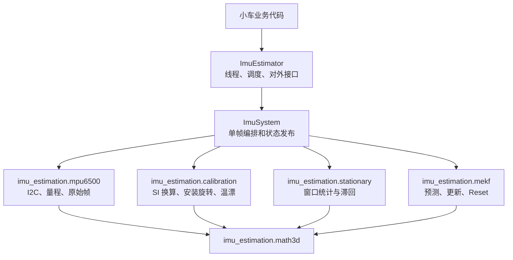
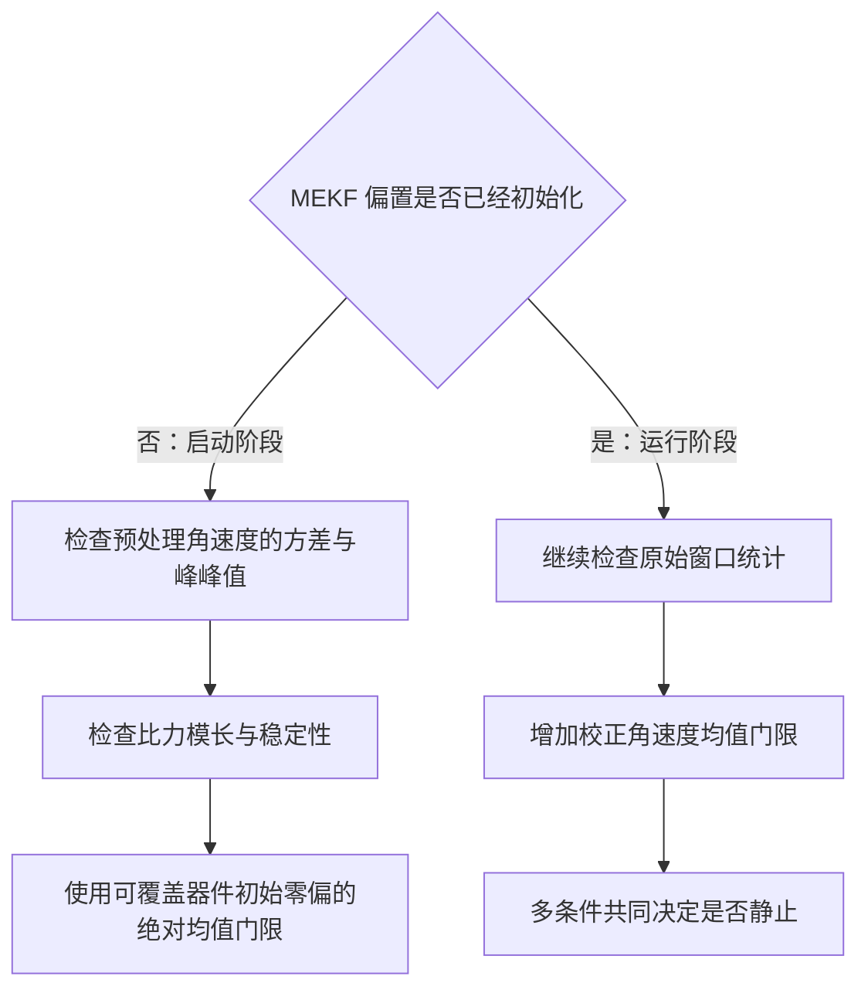
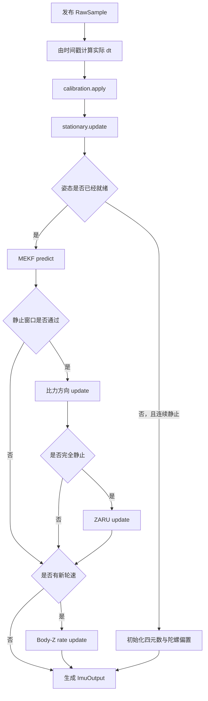
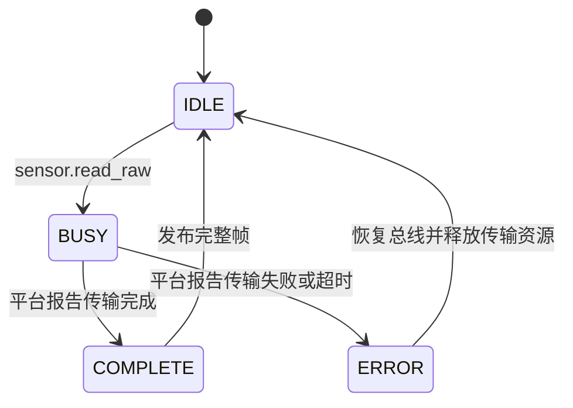

# 从零实现一个面向树莓派小车的 Python 六轴 IMU 解算包

这篇教程说明怎样在 Python 里实现一个可移植、可测试、能直接跑在树莓派 4B 小车
程序中的六轴姿态解算包。目标实现与本仓库 `python/` 下的 `imu_estimation` 包一致：

- 输入 MPU6050/MPU6500 的加速度、角速度、温度和时间戳；
- 输出完整四元数、重力倾斜 Roll/Pitch 和短期相对 Yaw；
- 使用启动静止调零、静止检测和零角速度更新（ZARU）抑制零偏；
- 使用 6 状态 MEKF 融合陀螺传播与比力方向；
- 允许差速轮等外部 Body-Z 角速度帮助估计 Yaw 轴偏置；
- 算法核心与 NumPy 数学层解耦，不依赖具体 MCU、RTOS 或演示框架。

完整数学约定见 [IMU 算法原理与接口说明](IMU_算法原理与接口说明.md)。本文重点回答：
代码应拆成哪些 Python 模块、每层输入输出是什么、实现顺序是什么，以及如何证明
没有写歪。

## 1. 先冻结数据契约和坐标约定

不要从“先写四元数积分”开始。第一步应固定所有模块共同遵守的物理定义，否则后面
即使每段公式都像是正确的，组合起来也可能出现符号、坐标和偏置重复扣除错误。

本实现固定为：

| 项目 | 固定约定 |
|---|---|
| 机体系 $B$ | X 向前，Y 向左，Z 向上 |
| 世界系 $W$ | Z 向上 |
| 四元数 $q_{WB}$ | Hamilton 四元数 $[w,x,y,z]$，把 B 系向量旋转到 W 系 |
| 误差定义 | $q_{\mathrm{true}}=q_{\mathrm{nominal}}\otimes\operatorname{Exp}(\delta\boldsymbol\theta)$，右乘误差 |
| 角速度 | rad/s |
| 比力 | m/s² |
| 时间 | 内部 $\Delta t$ 使用 s，采样时间戳使用 us |

加速度计测量的是比力：

$$
\mathbf f_B=R_{BW}\left(\mathbf a_W-\mathbf g_W\right),
\qquad
\mathbf g_W=
\begin{bmatrix}0&0&-g\end{bmatrix}^{\mathsf T}.
$$

世界系 Z 向上时，$\mathbf g_W=[0,0,-g]^{\mathsf T}$。设备水平静止时，
加速度计因此读到约 $[0,0,+g]^{\mathsf T}$，而不是
$[0,0,-g]^{\mathsf T}$。

最重要的数据链只允许存在一份运行时陀螺偏置：


启动静止均值直接初始化 `b_g`。运行期 ZARU 和轮速辅助继续更新同一个 `b_g`。
不要再增加一份 `startup_bias` 或 `b_R` 并从数据中永久扣除。

对应类型和配置首先定义在：

- `imu_estimation/types.py`：`RawSample`、`ImuSample`、`ImuOutput`、状态和
  `YawRateObservation`；
- `imu_estimation/mpu6500.py`：`SensorConfig`、`DeviceScale`、I2C 驱动和总线异常；
- `imu_estimation/config.py`：`CalibrationConfig`、`StationaryConfig`、`MekfConfig`
  和 JSON 标定档案加载。

建议每一种数据都带 `sequence` 和 `timestamp_us`。这样可以检查重复消费、时间倒退、
异步传输丢帧以及外部轮速是否与当前 IMU 帧匹配。

## 2. 按依赖方向拆分模块

本包的依赖关系是单向的：



核心规则是：下层不知道上层。

- `imu_estimation.math3d.py` 不知道传感器、I2C 和线程；
- `imu_estimation.mekf.py` 只接收 SI 物理量，不读取寄存器；
- `imu_estimation/mpu6500.py` 封装 I2C 和原始帧，不包含小车控制逻辑；
- `imu_estimation/system.py` 组合模块，但不直接操作显示或串口；
- `ImuEstimator` 负责线程、单调时间和采样事件；
- `examples/` 只演示当前小车如何调度和观察，不属于算法核心。

这样换 Linux 小车程序时只扩展运行壳，换滤波器时不用改驱动，换传感器个体时只
替换标定档案。

## 3. 实现最小数学层

先实现并测试以下无状态函数，再写滤波器：

```python
vector = imu_estimation.math3d.vec3_normalize(vector)
quaternion = imu_estimation.math3d.quaternion_normalize(quaternion)
cross = np.cross(a, b)
quaternion = imu_estimation.math3d.quaternion_multiply(left, right)
quaternion = imu_estimation.math3d.quaternion_exp(rotation_vector_rad)
rotation = imu_estimation.math3d.so3_exp(rotation_vector_rad)
jacobian = imu_estimation.math3d.so3_right_jacobian(rotation_vector_rad)
```

小角度时不能直接套含 $\sin\theta/\theta$ 的一般公式，因为 $\theta$ 接近零会造成
除零和精度损失。`quaternion_exp()` 和右 Jacobian 都需要小角度级数分支。

数学层至少测试：

1. 单位四元数乘法；
2. 绕 X/Y/Z 的正负 90°旋转；
3. 四元数与共轭相乘得到单位姿态；
4. `Exp(delta)` 在极小角度下连续；
5. Body→World 和 World→Body 互逆；
6. SO(3) 右 Jacobian 与有限差分一致。

对应实现是 `imu_estimation/math3d.py`。上述数学性质未验证前，不要继续调 MEKF
参数。

## 4. 把 MPU6500 驱动限制在原始帧层

核心驱动只依赖 `Mpu6500` 与 `SensorConfig`：

```python
sensor = Mpu6500(SensorConfig(
    bus_number=1,
    address=0x68,
    sample_rate_hz=200,
    accel_range=AccelRange.G16,
    gyro_range=GyroRange.G2000,
    dlpf=Dlpf.DLPF94,
))

with sensor:
    sensor.initialize()
    raw = sensor.read_raw(timestamp_us)
```

`Mpu6500` 的初始化顺序应固定：

1. 校验地址、采样率、量程和 DLPF；
2. 软件复位并等待器件恢复；
3. 读取 `WHO_AM_I`，只接受明确支持的型号；
4. 选择时钟源并解除六轴待机；
5. 复位信号通道；
6. 写采样分频、DLPF、陀螺和加速度量程；
7. 配置 DATA_RDY；
8. 只有所有步骤成功才进入就绪状态。

持续采样不要分开读取加速度和陀螺。Python 驱动通过 `smbus2` 或系统 `i2c` 能力一
次读取 14 字节：

| 字节顺序 | 内容 |
|---:|---|
| 0～5 | Accel X/Y/Z，每轴高字节在前 |
| 6～7 | Temperature，高字节在前 |
| 8～13 | Gyro X/Y/Z，每轴高字节在前 |

整帧解析为有符号大端 16 位数，并在完整成功后统一增加 `sequence`。驱动内部会捕获
I2C 异常并转成 `ImuBusError`；主线程或 `ImuEstimator` 负责决定是否继续运行。

接入时应验证寄存器写入顺序、`WHO_AM_I`、大小端解码、饱和标志和状态位，确认只有
完整成功的 14 字节帧才会推进序号。

## 5. 把原始计数变成明确的物理量

驱动只发布原始计数，所有确定性校正集中在 `imu_estimation.calibration.apply()`：

$$
\mathbf f_{\mathrm{pre},B}
=R_{BS}C_a
\left(\mathbf f_{\mathrm{raw,SI},S}-\mathbf b_a\right),
$$

$$
\boldsymbol\omega_{\mathrm{pre},B}
=R_{BS}C_g
\left(
\boldsymbol\omega_{\mathrm{raw,SI},S}-\mathbf b_T(T)
\right).
$$

其中：

- $S$ 是芯片传感器坐标系；
- $B$ 是车辆坐标系；
- $R_{BS}$ 是固定安装旋转；
- $C_a/C_g$ 是比例与非正交校正矩阵；
- $\mathbf b_a$ 是离线加速度偏置；
- $\mathbf b_T(T)$ 是离线陀螺温漂模型。

推荐处理顺序：

1. 根据实际量程把补码计数换为 `m/s²`、`rad/s` 和 `°C`；
2. 在传感器系减离线偏置；
3. 乘校正矩阵；
4. 最后通过 $R_{BS}$ 转到机体系；
5. 检查 NaN、Inf、温区钳位和原始饱和状态；
6. 发布 `ImuSample`，其中陀螺字段明确命名为 `gyro_pre_body_rad_s`。

通用算法和设备个体参数必须分离。设备档案只保存在 `examples/calibration.*.json`；
换器件时先使用单位矩阵和零偏置启动，再重新标定。具体采集方法见
[标定与复现教程](IMU_标定与复现教程.md)。

## 6. 先做静止检测，再允许 ZARU

单帧阈值无法可靠区分静止噪声和缓慢真实转动。本实现使用非重叠窗口和进入/退出
滞回，每个窗口统计：

- `omega_pre` 三轴均值；
- 每轴样本标准差；
- 每轴峰峰值；
- `omega_pre-b_g` 的运行期均值；
- 比力模长均值和标准差。

均值和方差用 Welford 在线算法计算，不需要保存整个窗口。默认采样率 200 Hz、窗口
0.2 s 时使用 40 个样本；连续 3 个合格窗口才进入静止，1 个不合格窗口退出。

启动和运行期必须使用不同逻辑：



如果只用 `omega_pre-b_g` 判断静止，错误的初始偏置可能导致永远进不了 ZARU；如果门限
太宽，又会把慢速真实旋转学习成偏置。必须同时采集“完全静止”和“缓慢起转”数据来
确定门限。

ZARU 只更新偏置，不能写成：

```python
if stationary and abs(gyro_z) < threshold:
    # 错误：停止 Yaw 积分。
    pass
```

正常做法是始终传播四元数，让滤波器在确认静止时把残余角速度归因到 `b_g`。收敛后
`omega_pre-b_g` 自然接近零，不会引入人为死区。

## 7. 实现 6 状态 MEKF

### 7.1 名义状态与误差状态

名义状态：

$$
\mathbf x_{\mathrm{nominal}}
=\left\{\hat q_{WB},\hat{\mathbf b}_g\right\}.
$$

右乘误差状态：

$$
\delta\mathbf x
=
\begin{bmatrix}
\delta\boldsymbol\theta\\
\delta\mathbf b_g
\end{bmatrix}
=
\begin{bmatrix}
\delta\theta_x&\delta\theta_y&\delta\theta_z&
\delta b_x&\delta b_y&\delta b_z
\end{bmatrix}^{\mathsf T}.
$$

四元数保留为 4 个名义状态，协方差只描述 6 维小误差。不要把四元数四个分量直接塞
进普通 EKF 后再加归一化补丁。

### 7.2 初始化

启动静止窗口完成后：

$$
\hat{\mathbf b}_g(0)
=\operatorname{mean}\!\left(
\boldsymbol\omega_{\mathrm{pre},B}
\right).
$$

用平均比力方向初始化 Roll/Pitch，初始 Yaw 定义为零。协方差中倾角、Yaw 和偏置使用
不同初始方差；Yaw 没有外部观测，因此初始不确定度应明显大于倾角。

### 7.3 名义姿态预测

每个完整样本先计算：

$$
\boldsymbol\omega_B
=\boldsymbol\omega_{\mathrm{pre},B}-\hat{\mathbf b}_g,
$$

$$
\hat q_{WB,k}
=\operatorname{normalize}\!\left(
\hat q_{WB,k-1}\otimes
\operatorname{Exp}(\boldsymbol\omega_B\Delta t)
\right).
$$

`dt` 必须来自单调时间戳。时间倒退、零周期或超出合法范围时拒绝当前帧，不要用固定
`0.005` 掩盖漏帧。

### 7.4 协方差预测

在当前右乘误差定义下：

$$
\begin{aligned}
\delta\dot{\boldsymbol\theta}
&=-[\boldsymbol\omega_B]_\times\delta\boldsymbol\theta
-\delta\mathbf b_g-\mathbf n_g,\\
\delta\dot{\mathbf b}_g&=\mathbf n_b,
\end{aligned}
$$

$$
F=
\begin{bmatrix}
-[\boldsymbol\omega_B]_\times&-I_3\\
0_3&0_3
\end{bmatrix}.
$$

配置中的陀螺白噪声和偏置随机游走是连续时间噪声密度，不是每采样点标准差。离散过程
噪声至少包含：

$$
\begin{aligned}
Q_{\theta\theta}
&=\sigma_g^2\Delta t\,I_3
+\frac{\sigma_b^2\Delta t^3}{3}I_3,\\
Q_{\theta b}=Q_{b\theta}^{\mathsf T}
&=-\frac{\sigma_b^2\Delta t^2}{2}I_3,\\
Q_{bb}&=\sigma_b^2\Delta t\,I_3.
\end{aligned}
$$

然后执行：

$$
P_k=\Phi_kP_{k-1}\Phi_k^{\mathsf T}+Q_{d,k},
\qquad
P_k\leftarrow\frac{1}{2}\left(P_k+P_k^{\mathsf T}\right).
$$

本包使用 SO(3) 指数映射和右 Jacobian 构造姿态、偏置耦合转移，核心位于
`imu_estimation.mekf.Mekf.predict()`。

### 7.5 比力方向更新

姿态只需要比力方向，不使用 9.80665 的模长直接修正角度：

$$
\hat{\mathbf f}_{\mathrm{meas}}
=\frac{\mathbf f_{\mathrm{pre},B}}
{\|\mathbf f_{\mathrm{pre},B}\|},
\qquad
\hat{\mathbf f}_{\mathrm{pred}}
=R_{BW}(\hat q_{WB})
\begin{bmatrix}0&0&1\end{bmatrix}^{\mathsf T},
$$

$$
\mathbf r_f
=\hat{\mathbf f}_{\mathrm{meas}}
\times\hat{\mathbf f}_{\mathrm{pred}}.
$$

该残差只有两个有效自由度，只能约束 Roll/Pitch。实现中把 Kalman 增益投影到重力方向
的二维切平面，并保持 fused yaw 不变，避免加速度观测通过数值耦合偷偷校正 Yaw。

动态平动时加速度不再代表重力，所以本包只在静止窗口通过、且比力模长接近 `g` 时
更新。车辆若需要动态倾角，应增加运动模型或其他传感器，不能简单放宽模长门限。

### 7.6 ZARU 更新

静止窗口均值对应观测：

$$
\mathbf z=\mathbf 0,
\qquad
\mathbf h(\mathbf x)
=\bar{\boldsymbol\omega}_{\mathrm{pre},B}-\hat{\mathbf b}_g,
$$

$$
\boldsymbol\nu
=-\left(
\bar{\boldsymbol\omega}_{\mathrm{pre},B}-\hat{\mathbf b}_g
\right),
\qquad
H=\begin{bmatrix}0_3&-I_3\end{bmatrix}.
$$

实现将姿态增益限制为零，只更新偏置及协方差。使用窗口均值或较低更新频率，避免将
经过 DLPF 的高度相关样本当成独立观测，导致协方差虚假快速收缩。

### 7.7 外部 Body-Z 角速度更新

差速轮给出的自然物理量是：

$$
z=\frac{v_R-v_L}{B},
\qquad
h(\mathbf x)=\omega_{\mathrm{pre},z}-\hat b_{g,z},
\qquad
\nu=z-h(\mathbf x).
$$

Jacobian 对 `b_g,z` 有明确偏导。本包进一步限制增益只更新 `b_g,z`，不把角速度
观测当成航向角观测。每条外部数据必须带新 `source_sequence`，防止低频轮速在高速
IMU 循环中被重复融合。

在 Python 包里通过 `ImuEstimator.set_yaw_rate_provider()` 注入；回调接收当前 IMU
微秒时间戳，返回新的 `YawRateObservation`。

### 7.8 Joseph 更新、误差注入与 Reset

测量更新不能只做“算出 `delta_theta`、修正 q、然后清零”。完整顺序是：

$$
S=HPH^{\mathsf T}+R,
\qquad
K=PH^{\mathsf T}S^{-1},
\qquad
\delta\mathbf x=K\boldsymbol\nu,
$$

$$
P_J=(I-KH)P(I-KH)^{\mathsf T}+KRK^{\mathsf T},
$$

$$
\hat q_{WB}^{+}
=\operatorname{normalize}\!\left(
\hat q_{WB}^{-}\otimes\operatorname{Exp}(\delta\boldsymbol\theta)
\right),
\qquad
\hat{\mathbf b}_g^{+}
=\hat{\mathbf b}_g^{-}+\delta\mathbf b_g,
$$

$$
P^{+}=G_{\mathrm{reset}}P_JG_{\mathrm{reset}}^{\mathsf T},
\qquad
P^{+}\leftarrow\frac{1}{2}
\left(P^{+}+P^{+\mathsf T}\right).
$$

`G_reset` 的姿态块使用当前右乘误差对应的 SO(3) 右 Jacobian。候选四元数、偏置和
协方差先在临时变量中完成数值检查，再一次性提交，避免半更新状态。

通用三维测量更新位于 `imu_estimation.mekf.Mekf._apply_measurement3()`。这一部分
是 MEKF 与“普通 EKF 套四元数”的关键区别，不能为了省代码删除。

## 8. 用系统层编排一帧数据

`ImuSystem.process_raw()` 不负责 I2C 调度，它只规定一帧完整数据到达后的顺序：



同步平台可以直接调用：

```python
status = imu_system.process_raw(raw, device_scale)
```

若使用 `ImuEstimator`，则由后台线程自动调用；小车业务只需：

```python
estimator = ImuEstimator(...)
estimator.start()
angles = estimator.get_angles()
```

只有完整解析成功的帧才能推进算法和发布新输出。

## 9. 实现通用运行壳与采样状态机

算法核心只要求运行壳提供三类能力：

1. 用 `Mpu6500.read_raw()` 获取完整原始帧；
2. 提供单调递增的微秒时间戳；
3. 在样本就绪时推进 `ImuSystem.process_raw()`，而不是在 ISR 里做重计算。

Python 参考实现在 `ImuEstimator` 里用后台线程维持固定周期采样，并把异常分类为
总线错误、数值错误和时间错误。小车程序也可以改成事件驱动，只要保证完整帧、单调
时间戳和异常分类不变。

推荐状态机如下：



样本事件回调只增加序号、记录时间并设置待处理标志；寄存器解析、矩阵运算和故障恢复
都在前台循环或线程中执行，避免 I2C 阻塞时间不可控。

平台若使用多线程，共享状态的线程安全由 `ImuEstimator` 负责；核心库只接受
“完整新帧”“尚未完成”或“传输失败”三种结果，不依赖具体实现。

仓库中的 `examples/car_demo.py` 和 `examples/health_check.py` 只是这一契约的一个
参考实现；移植到其他 Linux 小车程序时不需要保留具体 UI 代码。

## 10. 最后再设计业务公开接口

核心内部有四元数、协方差、原始欧拉角、纯陀螺对照和多种诊断量，但普通业务不应该
随意选择这些中间结果。Python 包对外公开 `ImuEstimator`：

```python
estimator = ImuEstimator(...)
estimator.start()
angles = estimator.get_angles()
health = estimator.get_health()
output = estimator.get_output()
estimator.set_yaw_rate_provider(provider)
estimator.reset_relative_yaw(0.0)
estimator.stop()
```

`examples/` 只用于当前独立演示；集成到既有小车程序时使用 `init + start + get`
三个阶段，不让库强接管业务主循环。

正式输出选择：

$$
\begin{aligned}
\phi_{\mathrm{tilt}}
&=\arcsin\!\left(\hat f_{\mathrm{pred},y}\right),\\
\theta_{\mathrm{tilt}}
&=\arcsin\!\left(-\hat f_{\mathrm{pred},x}\right),\\
\psi_{\mathrm{relative}}
&=\operatorname{wrap}\!\left(
\psi_{\mathrm{fused}}-\psi_{\mathrm{reference}}
\right).
\end{aligned}
$$

前两个量描述重力倾斜，与 Yaw 解耦，但范围只有 ±90°。内部 ZYX 欧拉角在 Pitch 接近
±90°时存在奇异和 Roll/Yaw 跳变，因此只用于诊断，不作为默认控制输入。

Yaw 清零只维护输出参考：

$$
\psi_{\mathrm{relative}}
=\operatorname{wrap}\!\left(
\psi_{\mathrm{fused}}-\psi_{\mathrm{reference}}
+\psi_{\mathrm{requested}}
\right).
$$

它不能修改 `q_WB` 或协方差。真正旋转估计器世界坐标系是另一项功能，不应伪装成 UI
清零接口。

## 11. 参数应放在哪一层

| 参数 | 所属位置 | 原因 |
|---|---|---|
| I2C 地址、量程、DLPF、采样率 | `SensorConfig` | 传感器寄存器配置 |
| 安装矩阵、比例、偏置、温漂 | 标定与设备档案 | 传感器个体和安装相关 |
| 窗口长度、静止门限、滞回 | `StationaryConfig` | 静止判定策略 |
| 过程噪声、观测方差、注入门限 | `MekfConfig` | 估计器统计模型 |
| 最大连续总线错误、过期阈值 | `RuntimeConfig` | 运行壳健壮性 |

不要把传感器个体补偿写进 `examples/car_demo.py`，也不要把平台句柄塞进 MEKF。换
平台、换器件和调滤波参数应分别只影响对应层。

## 12. 实现验证顺序

实现时按模块逐层验证，不要等接入树莓派后再猜原因：

1. 数学层：坐标变换、四元数、Exp 和 Jacobian；
2. 传感器驱动：寄存器、`WHO_AM_I`、14 字节帧和 I2C 异常状态；
3. 标定层：SI 换算、矩阵顺序、温度钳位和状态位；
4. 静止检测：静止、慢转、振动以及进入/退出滞回；
5. MEKF：正负小角、预测、比力更新、ZARU、Joseph 和 Reset；
6. 系统编排：启动状态机、帧序号、时间错误和外部轮速去重；
7. 使用 `pytest` 在宿主机完成单测；
8. 部署到树莓派后检查采样率、漏帧、总线错误和最坏执行时间；
9. 六面静置、慢转、Z 正反多圈、X/Y 往返、冷启动和热启动。

关键数学测试应包含：

- Yaw 变化不改变预测重力方向；
- 比力方向更新不虚假缩小 Yaw 可观性；
- Reset Jacobian 与有限差分一致；
- `ImuEstimator.reset_relative_yaw()` 不改变内部四元数和协方差；
- 外部 Body-Z 角速度只能更新预期的偏置状态；
- 同一外部观测 `source_sequence` 不会融合两次。

软件检查和宿主机单测只能证明实现闭合，不能代替真实传感器和车辆验证。

## 13. 常见实现错误

- 温度补偿和启动偏置各减一次，MEKF 又减一次 `b_g`；
- `q_WB`、乘法顺序和旋转函数的坐标含义没有写死；
- 把静止比力说成世界重力，导致预测方向符号相反；
- 用 corrected gyro 作为唯一静止依据，形成无法进入 ZARU 的死循环；
- 静止时直接停止 Yaw 积分，吞掉真实慢转；
- 在高速采样下反复融合相关的 DLPF 样本或重复轮速帧；
- 注入误差后清零 `delta_theta`，但忘记变换协方差；
- 用世界 Heading rate 公式处理实际提供的 Body-Z 差速轮角速度；
- 把 ZYX 欧拉角奇异误判为四元数状态跳变；
- 在 `examples/` 中散落个体标定常数，导致换一颗 MPU6050 就失效；
- 在线程里等待 I2C、打印日志或执行矩阵更新；
- 把标定档案写死在代码里，而不是通过 `examples/calibration.*.json` 配置；
- **把参数写进 Demo**：会让示例、硬件调度和设备个体数据耦合；本包禁止这样做。

## 14. 复刻完成的验收标准

一个可复用的六轴 IMU 库至少应满足：

- 核心源码能脱离 I2C 驱动在宿主机编译和测试；
- 新传感器可以使用单位标定启动，不依赖上一颗器件参数；
- 启动阶段不动时能稳定进入就绪，运动时不会错误调零；
- 静止后 `omega_pre-b_g` 接近零，但慢速真实旋转仍会被积分；
- 改变 Yaw 不会直接改变推荐 Roll/Pitch；
- Yaw 清零不改变滤波器内部状态；
- 原始、预处理和输出快照具有一致序号与时间戳；
- 总线、采样事件和日志故障不会被算法补偿掩盖；
- 文档明确说明无外部航向源时 Yaw 长期不可观。

达到这些条件后，再根据目标车辆的数据调整静止门限、过程噪声、观测方差和设备标定。
调参只能改善已经正确实现的模型，不能修复坐标、时序或状态定义错误。
